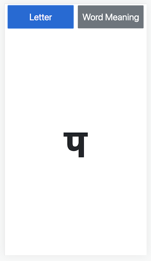

A responsive web app that flashes a Sanskrit letter for the audience to identify, then it can show a random word starting with the letter with its English meaning.

### Good For:-
- Teaching the young and the grown-up the Sanskrit letters
- Learn new Sanskrit words and their closest English meaning
- Play a game with it
- Have fun doing the above!

